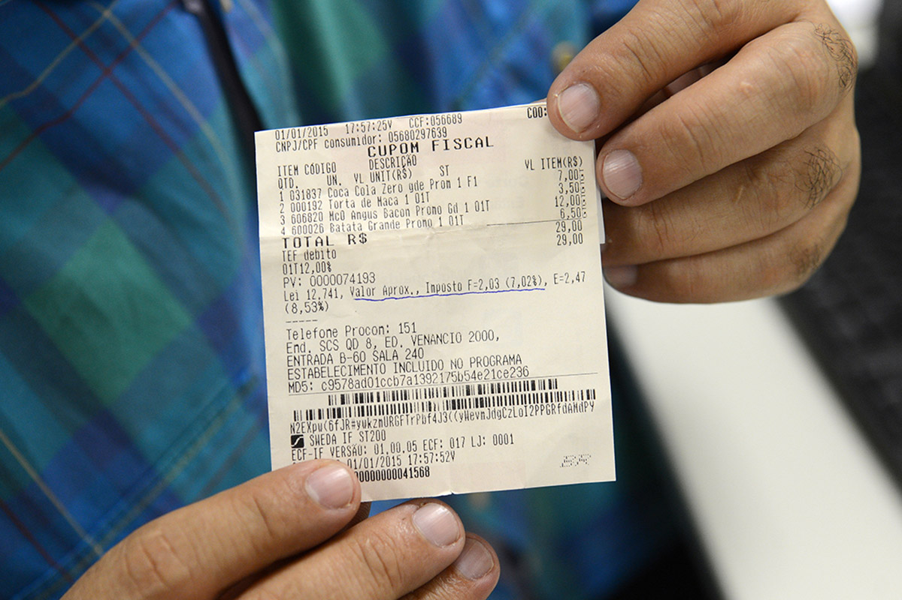
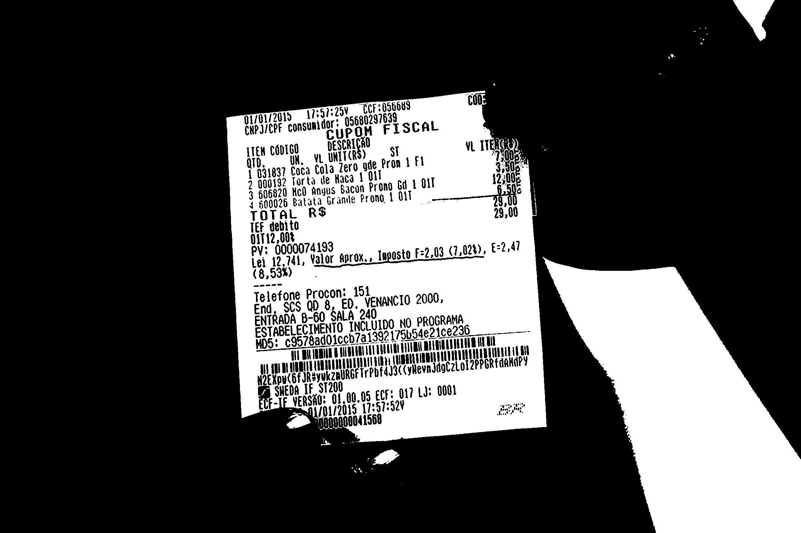
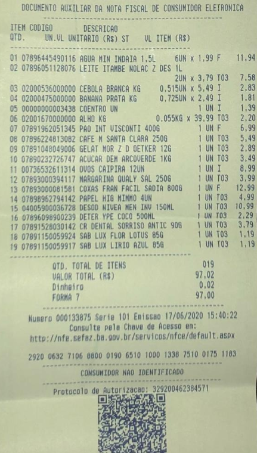
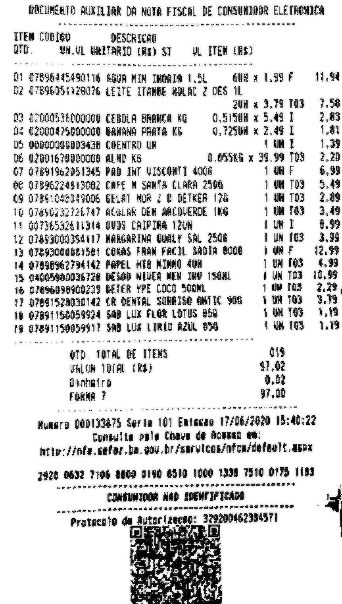

# `Conversor de nota fiscal em planilha`
# `Convert invoice to spreadsheet`

## Apresentação

O presente projeto foi originado no contexto das atividades da disciplina de pós-graduação *EA979A - Introdução a Computação Gráfica e Processamento de Imagens*, 
oferecida no primeiro semestre de 2022, na Unicamp, sob supervisão da Profa. Dra. Paula Dornhofer Paro Costa, do Departamento de Engenharia de Computação e Automação (DCA) da Faculdade de Engenharia Elétrica e de Computação (FEEC).

> |Nome  | RA | Curso|
> |--|--|--|
> | Rafael Cirino  | 223730  | Eng. Elétrica|

## Descrição do Projeto
> Observando o trabalho que meu pai tinha ao chegar do supermercado e ter que adicionar item por item da compra em uma planilha excel, pensei por que não deselvover um algoritmo capaz de a partir de uma imagem extrair as informações contidas na nota fiscal

## Plano de Trabalho
> Nesta primeira entrega, seu grupo deve ser capaz de identificar quais são as etapas necessárias para alcançar o objetivo proposto.
> Nesta seção, identifique claramente essas etapas, estimando o tempo que o seu grupo gastará em cada uma delas.
> Por exemplo:
> * Etapa 1 (1 semana): Estudo de técnicas OCR (Reconhecimento ótico de caracteres)
>    - Pesquisar sobre o funcionamento de algoritmos que indentificam texto em imagem 
> * Etapa 2 (2 semana): Blibliotecas, planilha e padrões
>   - Pesquisar bibliotecas para Python que reconhecem texto em imagem e decidir sobre utilizar uma ou desenvolver uma própria. 
>   - Pensar qual o melhor formato para salvar as informações em .csv, google sheets ou planilha padrão do Excel.
>   - Indentificar padrões contidos em diferentes notas fiscais.
> * Etapa 3 (6 semanas): Codificação.
>   - Desenvolver o conversor de texto em imagem para uma planilha, 
>   - Validar e testar para os mais diferentes dados possíveis
>   - Redigir o relatório a ser entregue no final
> 
> OBS: Ao longo das etapas vou montar um banco de dados com imagens de nota fiscal para validação ao final do projeto

## CNFP
### Sobre o OCR
OCR é um acrónimo para o inglês Optical Character Recognition, é uma tecnologia para reconhecer caracteres a partir de um arquivo de imagem ou mapa de bits sejam eles escaneados, escritos a mão, datilografados ou impressos. Dessa forma, através do OCR é possível obter um arquivo de texto editável.

### Tesseract e Pytesseract
O Tesseract é um mecanismo de recocimento de texto utilizando OCR, suporta uma grande variedade de idiomas. Tendo uma imagem como entrada, ele realiza alguns processamentos a fim de obter menos ruídos, em seguida, utilizando uma RNN chamada LSMT(Muito boa para reconhecer sequências longas) reconhece o texto contigo na imagem retornando uma string.

O Pytesseract, é um wrapper do Tesseract para python que em conjunto com a biblioteca PIL torna possível realizar essa técnica de reconhecimento sobre uma imagem

<figure>
    
    <figcaption>Loki com o pytesseract</figcaption>
</figure>

### Filtragem

A fim de tornar as letras e digitos mais nitidos para o ocr são utilizados 3 filtros diferentes: threshold, bilateralFilter e sharpein. Antes da utilização deles o tamanho da imagem é aumentada em 4 nas duas direções, com isso é possível garantir que os caracteres tenham aproximadamente pelo menos 10 pixels, tamanho necessário para reconhecimento ocr

    
      Original 

    
      Threshold 

    
     Bilateral 

    
     Sharpein 

<table>
<thead>
<th>
O. a É
) 000192 Tor
3 606920 Ho
4 600026 Batata Gram
TAL R$

cio Procon: 151

End, Scs QD 8, ED. VENANCIO 2000,

ENTRADA B-60 SALA 24 do

a AELEC MENTO INCLUI as

HDS: a d01C CAE 4e21C8236
TE Dm nm

qu LULA ua
PRA u(6fJBAYU oe trpntáJ3c CoMevndtol2Lod2 2PP a de?

Na A
i Ed 1.6 um Ly: 0001
S: RT
</th>

<th>
01/01/2010 WEST tc: 050009

CNP JICPF consunidor: 05080297639
cuPpOM F ISCAL

LTEM CÓDIGO DESCRIÇÃO

Qro. un. UALTCRS) $

VD. 437 Coca Cola lero gde Prom 1 Et

2 000132 Torta de aca 101

3 606820 HCO Angus gacon Promo 6d À MI

4 600026 Batata Grande Prong 1 011

Foca 1º 7

Ito
nz 8

ei 12,741, Valor Aron.» .

e a E torox,, Taposto 52,03 (102M» E:24
Telefone Procon: 151

nd, SCS QD 8, ED. VENANCIO 2000,

qui quo DU MISRLO LA Veto

n2EtpuC6f) GRE dANdPY
SMEDA 2
- am
</th>
<th>
01/01/2010 tr
NPJSCPF CON dr: Ee
umaN ê CUPOM À scaL

LTEM CÓDIGO dESCRI a
QTD. un. NL ITR $
1 031837 Coca al tola No gde Pron 1 Fi

2 000192 Torta d

3 606820 Hc Bacon Prono 6d 1 01

4 600026 Batata Gr ande Prono À OL
TAL

am
PV: 00000
ua da) A, "a jr aprox. , Inposto F=2,03 (1,02%), E:2,41

Telefone Procon: 151
E Scs QD 8, ED. a 2000,

ENTRADA B-60 SALA 24 qe

ESTABELECIMENTO INCLUL A

HDS: c95/8ad0ic a 4e21c6230
IARA a

Era wCOEJRAYU A Cá)

Na Rr
: Ed 0.6 gm 13: 000!
Ss PERU
</th>
</thead>
</table>

    
      Original 

    
      Threshold 

    
     Bilateral 

    
     Sharpein 

<table>
<thead>
<th>
DOCUMENTO AUXILIAR DA NOTA FISCAL DE CONSUNIDOR ELETRONICA

ITEM CODIGO DESCRICAO
gro. UN.UL UMITARIO CR$) ST UL ITEM CR$)

D1 07896445490116 AGUA MIN INDAIA 1,5L 6UN x 1,99 E
62 07896051128076 LEITE ITAMBE NOLAC 2 DES 1L

2UN x 3,79 T03
E3 02000536000000 CEBOLA BRANCA K6 0,515UN x 5,49 1
à 02000475000000 BANANA PRATA KG 0,725UN x 2,49 1
05 00000000003438 COENTRO UN TUNT
DE 02001670000000 ALHO K6 0,055KG x 39.99 TO3
07 07891952051345 PAD INT VISCONTI 4006 FUN F
06 07696224613082 CAFE M SANTA CLARA 2506 E UN TOS
09 G7BS!C4E049006 GELAT NOR Z D GETKER 126 TUR TOS
10 07696132726147 ACULAR DEM ARCOVERDE 1KG 1 UN TO3
11 00756532611314 OVOS CAIPIRA 12UN 1UNIT
12 07693000394117 NARGARINA QUALY SAL 2506 TN TOS
15 0769500008156t COXAS FRAN FACIL SADIA 8006 1 UNF
14 07898967794142 PAPEL HIG NINHO SUN 1 UN TOS
15 04005900036726 DESOD NIVEA MEN INU 150NL 1 UN To3
16 07696096900239 DETER YPE COCO SOONL 1 UN TOS
17 07891528030142 CR DENTAL SORRISO ANTIC 908 1 UM TOS
16 07891150059924 SAB LUX FLOR LOTUS 856 + UN TOS
19 07691150059917 SAB LUX LIRIO AZUL 650 VUN TOS
ÚTD. TOTAL DE ITENS 019
VALOR TOTAL (R$) 97,02
Dinheiro 0,02
FORMA 7 97,00

1,94

“DD LD VD VD 4 15 4 RO dO LO 45 O O 10 ca 4 DO

9 CO CO CO RP LA O RO a a AS 4

— —twnDais
To o do É

= —

Numero 000133675 Ser ta 101 Entssao 17/06/2020 15:40:22

Consulte pela Chave de Acesso ea:
http: /infe.cefez.bo. gov.br/servicos/nfca/default .aspx

2920 0632 7106 0800 0190 6510 1000 1338 7510 0173 1105
</th>

<th>
DOCUMENTO ani bem DA NOTA FISCAL DE CONSUMIDOR ELETRONICA

ITEM CODIGO DESCRICAO

gro UN.UL UNITARIO (R$) ST q o Di

O! 07896345490116 AGUA KIN INDATA 1,5% Em x 1,99 F
62 07896051128076 LEITE ITANBE NOLAC 2 DES 1L

2UN x 3,79 703
E3 02000536000000 CEBOLA BRANCA KG 0,515UN x 5,491
0% 02000475000000 BANANA PRATA KG 0,725UN x 2,49 1
05 00000000003438 COENTRO UN 1UNT
dé 02001670000000 ALHO K6 0.055KG x 39.99 TO3
07 07891952051345 PAO INT VISCONTI 4006 1 UN F
CE 07696224613082 CAFE N SANTA CLARA 2506 1 UM TO3
09 C7BS'C4L0I9006 GELAT MOR Z D GETKER 126 + UN TO3
10 U7eski 32726747 ACULAR DEM ARCOVERDE 1KG 1 UM TO3
11 00756532611314 OVOS CAIPIRA 12UN 1UNI
12 07693000394117 MARGARINA QUALY SAL 2506 TUM TOS
13 07E9I00006 1561 COXAS FRAM FACIL SADIA 8006 1 UNF
14 0789696Z794142 PAPEL MIG MINHO SUN 1 UM TOS
15 04005900036728 DESGO NIVEA MEN INV I50NL 1 UN TO3
16 07696096900239 DETER YPE COCO S00ML 1 UN TOS
17 07891528030142 CR DENTAL SORRISO ANTIC 906 1 UM TO3
16 07891150059924 SAB LUX FLOR LOTUS 854 + UM TO3
19 078911500599H7 so LUX LIato am o 1 UM TOS
ut TOTAL DE TENS 019
VALUK TOTAL (R$) 97.02
Dinheiro 0.02
FORMA 7 nm

11,94

DO tuo O cad o A 0 ms ma a td ad
SssssssEZCSE

s=z2ss

=
a

Numero 000133675 Ser tu 101 Entosao 17/06/2020 15:40:22

Consulte pola Chave de Acesso em:
mto: /infe cefos do. gov.br/servicos/nfca/default asp

2920 0632 7106 osso 0190 6510 namo 1330 7510 0173 1103
</th>
<th>
DOCUMENTO AUXILIAR DA NOTA FISCAL DE CONSUNIDOR ELETRONICA
TEN CODIGO DESCRICAO
OD UML UMITARIO CRE) SEUL ITEM CAS)
DN O7BGIASASONIE AGUA MIM INDAIA 1.5L GUN M I.9IE 11,0
2 07896051128076 LEITE ITAMBE NOLAC 2 DES IL

2UN x 3,79 703 7,58
€3 02000536000000 CEBOLA BRANCA KG 0,515UN x 5,49 1 2,83
04 02000475000000 BANANA PRATA KG O.725UN x 2,491 4,81
05 00000000003438 COENTRO UN TNT 1,39
D6 02001670000000 ALHO K6 0,055K6 x 39.99 TO3 2,20
07 07891962051345 PÃO INT VISCONTI 4006 1 UM F 6.99
OE 07896224B13082 CAFE N SANTA CLARA 2506 TUM TOS 5,49
09 07851045049006 GELAT MOR Z D OETKER 126 tuNTOS 2.89
10 07890232726747 ACULAR DEM ARCOVERDE 1KG FUN TOS 3,49
11 00736532611314 OVOS CAIPIRA 12UN TUNT 8.99
12 07693000394117 MARGARINA QUALY SAL 2506 TUNTOS 3,99
13 07893000081581 COXAS FRAN FACIL SADIA 6006 IUNF 12,99
14 07898962794142 PAPEL HEG MINHO SUN TUNTOS 4,99
15 04005900036728 DESOO NIVEA MEN IHU 150NL 1 UN TOS 10,99
16 07696098900239 DETER YPE COCO SO0NL UN TOS 2,29,
17 07891528030142 CR DENTAL SORRISO ANTIC 906 1 UN TOS 3,79
16 07091150059924 SAB LUX FLOR LOTUS 856 VUNTOS 1,19
19 OT691150059817 as LUX LIRIO au 856 TUM TOS 1,19

om TOTAL DE ITENS 019

VALOR TOTAL (R$) 97,02

Dinhatro 0,02

Fama 7 97,00

lemsra 000133675 sera mo Eststos 17/06/2020 15: 4: ua
Consulta pela Chave de Acesso ea:
http: //nfe.cefaz.da.oou.br/servicos/nfca/default.asox

2920 0632 7106 sumo 0190 6510 1000 1330 2510 0175 1103

cononste do obs erss ancas snsseDocssa assada j

COMBUNIDOR NAO IDENTIFICADO

=

protocolo de Jutar | tucoo; 329200462384571
ESA [8]
</th>
</thead>
</table>

### Requirements
> - [Tesseract](https://github.com/tesseract-ocr/tessdoc) - v5.0.1
> - Pytesseract - pip install pytesseract
> - Numpy - pip install numpy
> - Pillow - pip install pillow
## Referências Bibliográficas
> * How to OCR with Tesseract, OpenCV and Python - https://nanonets.com/blog/ocr-with-tesseract/
>
> * OCR a document, form, or invoice with Tesseract, OpenCV, and Python - https://pyimagesearch.com/2020/09/07/ocr-a-document-form-or-invoice-with-tesseract-opencv-and-python/
>
> * “Lendo imagens”! — Uma abordagem a OCR com Google tesseract e Python! - https://blog.codeexpertslearning.com.br/lendo-imagens-uma-abordagem-%C3%A0-ocr-com-google-tesseract-e-python-ee8e8009f2ab
