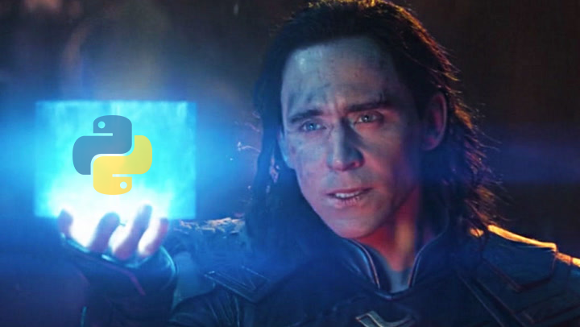

# `Conversor de nota fiscal em planilha`
# `Convert invoice to spreadsheet`

## Apresentação

O presente projeto foi originado no contexto das atividades da disciplina de pós-graduação *EA979A - Introdução a Computação Gráfica e Processamento de Imagens*, 
oferecida no primeiro semestre de 2022, na Unicamp, sob supervisão da Profa. Dra. Paula Dornhofer Paro Costa, do Departamento de Engenharia de Computação e Automação (DCA) da Faculdade de Engenharia Elétrica e de Computação (FEEC).

> |Nome  | Curso|
> |--|--|--|
> | Rafael Cirino | Eng. Elétrica|

## Descrição do Projeto
> Observando o trabalho que meu pai tinha ao chegar do supermercado e ter que adicionar item por item da compra em uma planilha excel, pensei por que não deselvover um algoritmo capaz de a partir de uma imagem extrair as informações contidas na nota fiscal

## CNFP
### Sobre o OCR
OCR é um acrónimo para o inglês Optical Character Recognition, é uma tecnologia para reconhecer caracteres a partir de um arquivo de imagem ou mapa de bits sejam eles escaneados, escritos a mão, datilografados ou impressos. Dessa forma, através do OCR é possível obter um arquivo de texto editável.

### Tesseract e Pytesseract
O Tesseract é um mecanismo de recocimento de texto utilizando OCR, suporta uma grande variedade de idiomas. Tendo uma imagem como entrada, ele realiza alguns processamentos a fim de obter menos ruídos, em seguida, utilizando uma RNN chamada LSMT(Muito boa para reconhecer sequências longas) reconhece o texto contigo na imagem retornando uma string.

O Pytesseract, é um wrapper do Tesseract para python que em conjunto com a biblioteca PIL torna possível realizar essa técnica de reconhecimento sobre uma imagem

<figure>
    
    <figcaption>Loki com o pytesseract</figcaption>
</figure>

### Requirements
> - Numpy - pip install numpy
> - Pillow - pip install pillow
> - OCR
>   - [Tesseract](https://github.com/tesseract-ocr/tessdoc) - v5.0.1
>   - Pytesseract - pip install pytesseract
> - QR code
>   - pip install pyzbar

### Filtros

#### Threshold
Esse filtro pode ser também chamado de 8 ou 80, é definido um valor limite e tudo que estiver abaixo dele é 0 e o que estiver acima é o valor máximo possível

#### Bilateral
Utilizado para remover ruído da imagem, este filtro gaussiano busca preservar as bordas enquanto desfoca a região mais central da imagem considerando os pixels vizinhos.

#### sharpein
Este filtro de média, busca realçar as bordas, tornando as mais nitidas para a leitura do algoritmo.

#### Filtragem

A fim de tornar as letras e digitos mais nitidos para o ocr são utilizados 3 filtros diferentes: threshold, bilateralFilter e sharpein. Antes da utilização deles o tamanho da imagem é aumentada em 4 nas duas direções, com isso é possível garantir que os caracteres tenham aproximadamente pelo menos 10 pixels, tamanho necessário para reconhecimento ocr

#### Pior caso

    
      Original 

    
      Threshold 

    
     Bilateral 

    
     Sharpein 

#### Melhor caso

    
      Original 

    
      Threshold 

    
     Bilateral 

    
     Sharpein 

### Mudança de abordagem
Após testes realizado com o OCR nas notas fiscais, chegou-se a conclusão que não seria eficiente continuar com o método proposto, visto que as notas ficais não seguem um padrão e mesmo após a passagem dos filtros pela imagem, está muito complicado realçar as bordas das letras, de forma que uma não se junte com outra.

Em virtude disso, será feita uma mudança de abordagem para indentificar o QRcode embutido em cada cupom fiscal, utilizando a biblioteca pyzbar.

### QR code
Um QRcode é dividido em blocos, sendo o tamanho mais comum de 21x21, podendo armazenar 8bytes de informação. Qualquer um deles possui uma margem branca em sua borda, indicando para o algoritmo que ali termina o código. Aqueles 3 quadrados bem caracteristicos de todo QRcode, é para informar ao algoritmo que se trata de um QRcode e definir os limites externos.

No canto inferior direito há a presença de um quadrado, cuja função é calibrar o leitor, é ele que irá indicar qual o padrão de espaçamento. Há também um pequeno campo informando a versão do QRcode ali presente, e todo o restante conrreponde aos blocos de informação comentado anteriormente

<figure>
    
    <figcaption>Indentificando QR code</figcaption>
</figure>

#### Algoritmo

Diagrama de processo do algoritmo desenvolvido

<figure>
    
    <figcaption>Diagramam do algortitmo desenvolvido</figcaption>
</figure>

#### Resultado

A seguir há um exemplo da planilha que pode ser gerada com este algoritmo

<figure>
    
    <figcaption>Exemplo de planilha</figcaption>
</figure>

Em relação a métrica de tempo e resultado para os filtros em série temos:

## Referências Bibliográficas
> * How to OCR with Tesseract, OpenCV and Python - https://nanonets.com/blog/ocr-with-tesseract/
>
> * OCR a document, form, or invoice with Tesseract, OpenCV, and Python - https://pyimagesearch.com/2020/09/07/ocr-a-document-form-or-invoice-with-tesseract-opencv-and-python/
>
> * “Lendo imagens”! — Uma abordagem a OCR com Google tesseract e Python! - https://blog.codeexpertslearning.com.br/lendo-imagens-uma-abordagem-%C3%A0-ocr-com-google-tesseract-e-python-ee8e8009f2ab
>
> * https://pypi.org/project/pyzbar/
>
> * https://medium.com/machina-sapiens/raspagem-de-dados-com-python-e-beautifulsoup-1b1b7019774c
> 
> * https://imasters.com.br/back-end/como-fazer-web-scraping-com-python
>
> * https://www.kaspersky.com.br/resource-center/definitions/what-is-a-qr-code-how-to-scan
